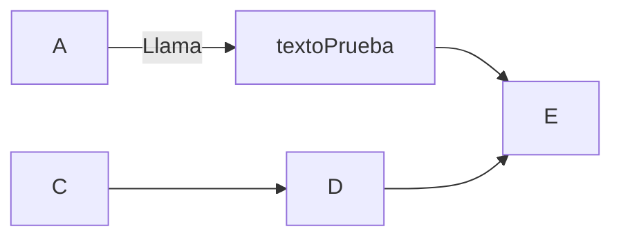
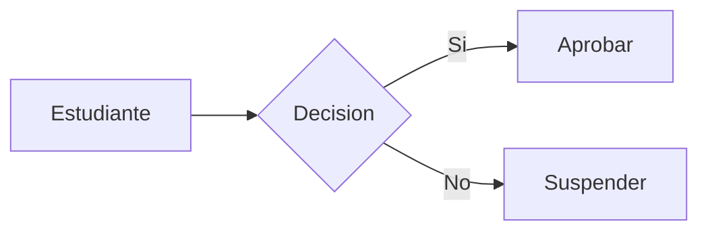

+++
title = 'Basico'
date = 2024-10-04T13:23:51+02:00
draft = false
+++

## Edición básica

### Títulos

Para establecer los titulos usaré la siguiente sintaxis:

```makefile
# titulo1
## titulo2
### titulo3
#### titulo4
##### titulo5
###### titulo6
```

y se verá

---
# titulo1
## titulo2
### titulo3
#### titulo4
##### titulo5
###### titulo6
----

### Negrita y formato

Para ver el texto en negrita escribo

```markdown
**Texto en negrita** texto normal
```

Y se verá

**Texto en negrita** texto normal

### Creando

Para meter un shortcode debes de especificarlo con los siguientes metacaracteres:
``` bash
{{``<>}}
```

Insertar un vídeo:



PHP es un lenguaje interesante y bonito 
accede a la web

### Mermaid:




